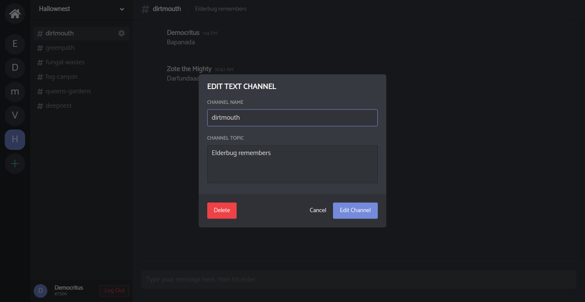

# Discrud

## Table of Contents
- [Live Site](#live-site)
- [Introduction](#introduction)
- [Features Breakdown](#features-breakdown)
- [Future Directions](#future-directions)

## Live Site

[https://discrud.herokuapp.com/](https://discrud.herokuapp.com/)

## Introduction

Discrud is a full stack single-page clone of the [Discord](https://www.discordapp.com) web app. The app allows users to create servers with multiple chat rooms, called channels. Registered users can choose to join existing servers with a unique invitation code, or create and manage their own server.

### Technologies used:
* ReactJS/Redux (frontend)
* Ruby on Rails (backend server)
* PostgreSQL (database)
* Heroku (hosting)

## Features Breakdown

### User Authentication
Secure user authentication is a multi-faceted challenge. To ensure that passwords are not vulnerable in the event of a database breach, all passwords are stored as salted hashes.

Session information is tracked via a unique session token in the cookies. The frontend fetches all data via backend API calls. To ensure that logged-in users have immediate access to the app, the backend server bootstraps the current user on the initial page load. This is done with an ERB snippet that generates JavaScript to save the current user on the global window.

```html
<% if logged_in? %>
<script type="text/javascript">
  window.currentUser = <%= render(
    "api/users/user.json.jbuilder",
    user: current_user
  ).html_safe %>
</script>
<% end %>
```

The registration and login forms render errors in-line to inform the user of any problems.


### Live Chat

Live chat is another challenging feature of this app. Socket connections through Action Cable are essential to the feature. Connections are identified by their current user. 

```ruby
module ApplicationCable
  class Connection < ActionCable::Connection::Base
    identified_by :current_user

    def connect
      self.current_user = find_verified_user
    end

    private
    
    def find_verified_user
      verified_user = User.find_by(session_token: request.session[:session_token])
      verified_user || reject_unauthorized_connection
    end
  end
end

```

This must be handled with care, so that the connection is invalidated when the user logs out. In the log out method, the connection is disconnected, so that the next user will get a fresh connection.

```ruby
ActionCable.server.remote_connections.where(current_user: current_user).disconnect
```

### Modals
The app features several modal menus. The user can exit a modal menu at any time by clicking outside the menu.



## Future Directions
* Direct messages
* Server member lists
* Member online status